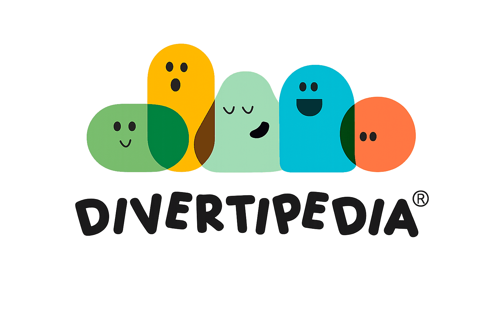

# Divertipedia | Centro Integral Infantil 🎨🧸

 Divertipedia es una Landing Page para un Centro Integral Infantil enfocado en potenciar las habilidades cognitivas y sociales de los más pequeños a través del juego dinámico, la exploración creativa y un enfoque pedagógico personalizado.

## 🌟 Características del Proyecto

- **Diseño Responsivo:** Completamente adaptable a dispositivos móviles, tablets y escritorio gracias a Tailwind CSS.
- **Tema Personalizado:** Paleta de colores cálida y amigable generada con tokens de diseño (inspirado en Material Design 3) directamente en la configuración de Tailwind.
- **Navegación Fluida:** Menú fijo (`sticky`) con desplazamiento suave (`scroll-smooth`) entre las distintas secciones de la página.
- **Integración de Mapas:** Uso de **Leaflet.js** con OpenStreetMap para mostrar la ubicación exacta del centro en Culiacán, Sinaloa.
- **Llamadas a la Acción (CTA):** Botón flotante e integraciones directas para contacto vía WhatsApp.
- **Tipografía y UI:** Uso de *Quicksand* (Google Fonts) para un aspecto infantil/amigable y *Material Symbols* para la iconografía.

## 🚀 Tecnologías Utilizadas

- **HTML5** (Semántico)
- **Tailwind CSS** (vía CDN con configuración y tema personalizado)
- **Leaflet.js** (Mapas interactivos de código abierto)
- **Google Fonts** (Fuente *Quicksand*)
- **Google Material Symbols** (Iconografía)

## 🧩 Secciones de la Página

1. **Inicio (Hero):** Mensaje principal de la marca y accesos directos de contacto.
2. **Quiénes Somos:** Misión del centro, destacando sus áreas principales (Lenguaje, Inteligencia Emocional, Aprendizaje e Integración Sensorial) y sus +4 años de experiencia.
3. **Servicios:** Tarjetas descriptivas de las terapias y programas ofrecidos:
   - Prekinder KREA (Enfoque Montessori)
   - Terapia de Lenguaje y Habla
   - Terapia Emocional
   - Terapia Conductual
   - Terapia de Aprendizaje
   - Terapia Integral
4. **Beneficios:** Propuesta de valor del centro (Personal capacitado, ambiente seguro, atención personalizada, etc.).
5. **Galería:** Estilo *Masonry* para mostrar las instalaciones y momentos divertidos.
6. **Testimonios:** Reseñas y experiencias reales de la "DivertiFamilia".
7. **Contacto y Mapa:** Dirección física en Culiacán, horarios de atención, números de teléfono y mapa interactivo.

## 🛠️ Instalación y Uso Local

Al ser un proyecto estático construido con HTML y Tailwind por CDN, no requiere un proceso de compilación complejo (Node.js no es estrictamente necesario para visualizarlo).

1. Clona el repositorio:
   ```bash
   git clone [https://github.com/tu-usuario/divertipedia.git](https://github.com/tu-usuario/divertipedia.git)